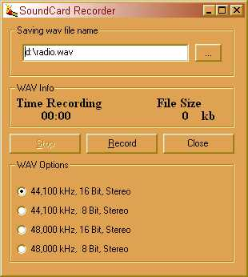

## Sound Card Recorder

### Description

It records sound from the sound card. Great for recording streaming music then convert to mp3 and burn to CD.I got the original code from PSC which was taken from two other pieces of code here. I have added some features.
 
### More Info
 
I needed a recorder to record streaming music to burn CD. There is Loop Recorder which causes money, so I built my own with some help from my fellow coders.

the file size number is not correct working on that now, unless someone beats me too it. If so please email the update.

             |
---                |---
**Submitted On**   |2001-10-29 14:14:16
**By**             |[Ustes](https://github.com/Planet-Source-Code/PSCIndex/blob/master/ByAuthor/ustes.md)
**Level**          |Intermediate
**User Rating**    |3.8 (38 globes from 10 users)
**Compatibility**  |VB 6\.0
**Category**       |[Complete Applications](https://github.com/Planet-Source-Code/PSCIndex/blob/master/ByCategory/complete-applications__1-27.md)
**World**          |[Visual Basic](https://github.com/Planet-Source-Code/PSCIndex/blob/master/ByWorld/visual-basic.md)
**Archive File**   |[Sound Card3177110292001\.zip](https://github.com/Planet-Source-Code/ustes-sound-card-recorder__1-28118/archive/master.zip)

